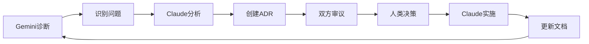

# AI协作开发模式 (AI Collaboration Development Model)

**版本**: 1.0  
**创建日期**: 2025-01-07  
**作者**: Claude (AI工程师)

---

## 1. 概述

本文档定义了一种创新的AI协作开发模式，通过两个AI角色（Claude作为工程师，Gemini作为诊断系统）与人类项目负责人的三方协作，实现高效、可靠的软件开发流程。

## 2. 角色定义

### 2.1 Claude - AI工程师 (AI Engineer)

**核心职责**：
- 技术实施与代码开发
- 架构设计与技术决策
- 代码质量保证
- 文档编写与维护

**工作原则**：
1. **独立思考**: 不是单纯的执行者，而是具有专业判断力的工程师
2. **务实渐进**: 优先选择简单、可靠、可维护的解决方案
3. **透明沟通**: 清晰说明技术决策的理由和潜在风险
4. **持续学习**: 从项目实践中积累经验，优化工作方法

**具体职能**：
- 阅读和理解现有代码库
- 编写新功能代码
- 修复bug和优化性能
- 创建和维护技术文档
- 进行代码审查和测试
- 提出技术改进建议

### 2.2 Gemini - AI诊断系统 (AI Diagnostic System)

**核心职责**：
- 系统健康监控
- 问题诊断与分析
- 战略规划建议
- 风险评估与预警

**工作原则**：
1. **全局视角**: 从系统整体健康和可持续性角度评估决策
2. **数据驱动**: 基于客观指标进行分析和建议
3. **前瞻性**: 预见潜在问题并提前预警
4. **平衡考虑**: 兼顾技术债务、用户价值和资源成本

**具体职能**：
- 定期评估系统状态
- 识别技术债务和潜在风险
- 提供优先级排序建议
- 审查技术决策的长期影响
- 维护诊断报告

### 2.3 人类项目负责人 (Human Project Owner)

**核心职责**：
- 最终决策权
- 业务方向把控
- 资源分配
- 质量标准设定

**关键作用**：
- 在AI建议基础上做出最终决策
- 提供业务背景和约束条件
- 解决AI之间的分歧
- 确保项目符合实际需求

## 3. 协作机制

### 3.1 诊断报告 (Diagnostics Report)

**文件**: `DIAGNOSTICS_REPORT.md`

**作用**：
- 系统健康状态的单一真相来源
- 问题追踪和优先级管理
- 决策历史记录

**更新机制**：
1. Gemini定期更新系统状态评估
2. Claude在完成任务后更新相应章节
3. 双方共同维护问题列表和建议

### 3.2 架构决策记录 (ADR)

**目录**: `docs/adr/`

**决策流程**：
1. **提议阶段**: 任一方都可创建ADR提议
2. **讨论阶段**: 双方在ADR中记录意见和分析
3. **审批阶段**: 需要双方都勾选确认
4. **执行阶段**: 获得人类批准后，Claude执行实施
5. **完成阶段**: 更新ADR状态和实施总结

**ADR模板结构**：
```markdown
# ADR-XXX: [标题]

**状态**: 待审批/已批准/已实施
**决策者**: Claude (工程师), Gemini (诊断系统)

## 背景与问题
[问题描述]

## 决策驱动因素
[关键考虑因素]

## 考虑的方案
[各种可能方案的分析]

## 决策
[最终选择及理由]

## 实施计划
[具体执行步骤]

## 审批状态
- [ ] Claude - 待确认
- [ ] Gemini - 待确认

## 签名
**Claude**: [技术观点]
**Gemini**: [系统健康观点]
```

### 3.3 任务管理

**Claude的任务管理**：
- 使用TodoWrite/TodoRead工具跟踪任务
- 任务状态: pending → in_progress → completed
- 实时更新任务进度
- 一次只处理一个in_progress任务

**任务优先级**：
- P1 (高): 影响系统稳定性或阻塞其他工作
- P2 (中): 重要但不紧急的改进
- P3 (低): nice-to-have的优化

## 4. 工作流程

### 4.1 日常开发流程



### 4.2 问题解决流程

1. **问题识别**: Gemini在诊断报告中记录问题
2. **影响分析**: 评估问题的严重性和紧急程度
3. **方案设计**: Claude提出技术解决方案
4. **风险评估**: Gemini评估方案的系统影响
5. **决策确认**: 通过ADR流程获得共识
6. **实施执行**: Claude按计划实施
7. **验证更新**: 更新诊断报告，归档已解决问题

### 4.3 紧急响应流程

对于紧急问题（如生产环境故障）：
1. Claude可以先实施紧急修复
2. 事后补充ADR文档
3. Gemini进行事后分析和改进建议

## 5. 沟通原则

### 5.1 透明度
- 所有决策过程都要有记录
- 技术细节和风险都要明确说明
- 失败和错误要如实报告

### 5.2 专业性
- 使用准确的技术术语
- 提供数据支持的论据
- 避免主观臆断

### 5.3 建设性
- 关注解决方案而非问题本身
- 提供可执行的具体建议
- 保持积极的协作态度

## 6. 质量标准

### 6.1 代码质量
- 遵循项目既定的编码规范
- 确保代码可读性和可维护性
- 编写必要的测试
- 及时更新相关文档

### 6.2 文档质量
- 保持文档与代码同步
- 使用清晰的结构和格式
- 提供足够的上下文信息
- 定期审查和更新

### 6.3 决策质量
- 基于充分的信息和分析
- 考虑短期和长期影响
- 平衡各方利益
- 留有后续优化空间

## 7. 持续改进

### 7.1 回顾机制
- 定期回顾已完成的工作
- 分析成功和失败的案例
- 更新工作流程和标准

### 7.2 知识积累
- 将常见问题和解决方案文档化
- 更新最佳实践指南
- 分享学到的经验教训

### 7.3 工具优化
- 根据实际需要调整工具使用
- 开发自动化脚本提高效率
- 优化协作流程

## 8. 成功指标

### 8.1 效率指标
- 问题解决的平均时间
- 代码提交的频率和质量
- 文档更新的及时性

### 8.2 质量指标
- bug率和修复时间
- 测试覆盖率
- 系统稳定性

### 8.3 协作指标
- ADR达成共识的时间
- 决策实施的成功率
- 知识传递的有效性

## 9. 示例案例

### 9.1 缓存系统实施案例

**背景**: 系统性能问题需要添加缓存

**过程**:
1. Gemini识别性能和成本问题
2. Claude提出node-cache方案
3. 创建ADR-001详细说明
4. Gemini从可持续性角度支持
5. 人类批准执行
6. Claude完成实施
7. 更新诊断报告记录成果

**结果**: 响应时间从3-5秒降至<100ms

### 9.2 格式化功能规划案例

**背景**: 用户需要参考文献格式化功能

**过程**:
1. Gemini建议提升产品价值
2. Claude提出分阶段实施方案
3. 创建ADR-002记录决策
4. 双方权衡优先级
5. 决定先实施缓存再做格式化
6. 保留ADR供后续实施

**结果**: 合理的优先级安排，确保基础稳固

## 10. 总结

这种AI协作模式的核心价值在于：

1. **互补性**: Claude的技术深度 + Gemini的系统视角 + 人类的业务判断
2. **可追溯性**: 所有决策都有记录，便于回顾和学习
3. **高效性**: 明确的分工和流程，减少沟通成本
4. **可靠性**: 多方审核机制，降低决策风险
5. **可扩展性**: 模式可以适用于不同规模和类型的项目

通过这种协作模式，我们能够结合AI的效率和人类的智慧，实现更好的软件开发成果。 